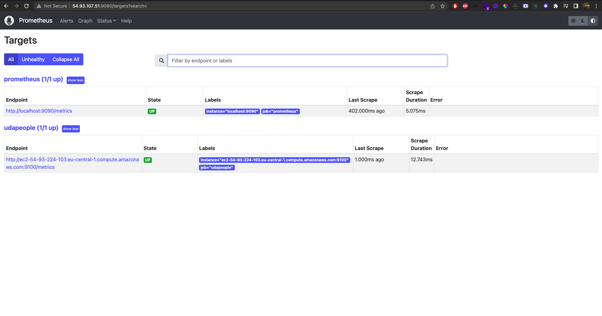
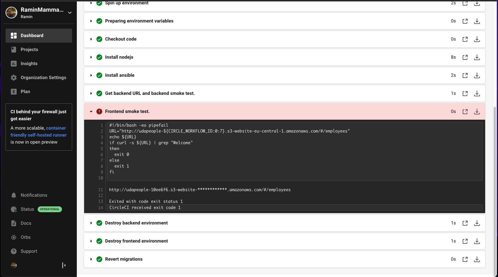
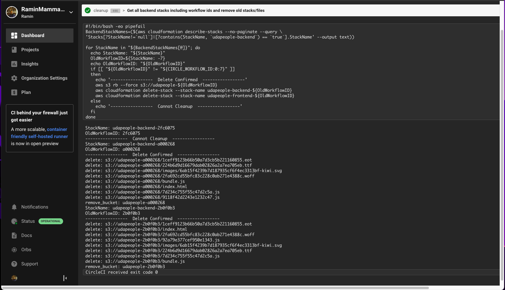
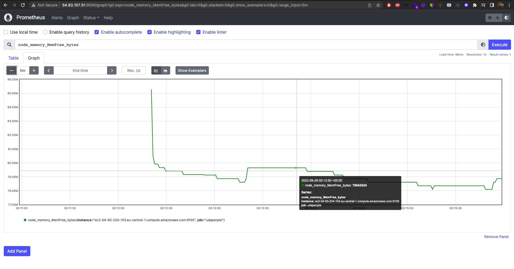

## Autodeployment with CircleCI Continuous CI/CD 

In this project I demonstrated an ability work with the key concepts related to Continuous Integration/Continuous Deployment (CI/CD). Specifically, it involved designing and building CI/CD pipelines that support Continuous Delivery processes, using a configuration management tool for cloud-based server deployment, and implementing centralized structured logging to surface critical server errors for diagnosis. Through these tasks, the project allowed for a deeper understanding of the fundamentals and benefits of CI/CD and its role in achieving, building, and deploying automation for cloud-based software products.

This repository includes the solution CircleCI pipelines and the screenshot of the finished tasks for Udacity Cloud DevOps course. The `./backend` and frontend `./project` projects were provided my the course team, though I needed to make some of the unit tests and smoke tests to pass.

### Built With

- [Circle CI](www.circleci.com) - Cloud-based CI/CD service
- [Amazon AWS](https://aws.amazon.com/) - Cloud services
- [AWS CLI](https://aws.amazon.com/cli/) - Command-line tool for AWS
- [CloudFormation](https://aws.amazon.com/cloudformation/) - Infrastrcuture as code
- [Ansible](https://www.ansible.com/) - Configuration management tool
- [Prometheus](https://prometheus.io/) - Monitoring tool

### Project Requirements by Udacity Course Team

* [Selling CI/CD](instructions/0-selling-cicd.md)
* [Getting Started](instructions/1-getting-started.md)
* [Deploying Working, Trustworthy Software](instructions/2-deploying-trustworthy-code.md)
* [Configuration Management](instructions/3-configuration-management.md)

* [Turn Errors into Sirens](instructions/4-turn-errors-into-sirens.md)

### Project Submission 
The screenshorts for project submission are below.
  1. Public Url to GitHub repository: [URL01](https://github.com/RaminMammadzada/autodeploy_with_ci_cd_tools)
  2. Public URL for your S3 Bucket (frontend project): [URL02](https://udapeople-5550dc4.s3.eu-central-1.amazonaws.com/index.html) - *this URL for Udacity team to check the result of my project. It will not be available in later time, due to of its cost.*
  3. Screenshot of AWS console in Cloudfront and public URL for your CloudFront distribution:
  

  4. Public URLs to deployed application back-end in EC2 
  5. The screenshot of Prometheus Server with its Public URL: 

  6. Failed job because of compile errors: 
  7. Failed job because of unit tests: 
  8. Failed job because of vulnerable packages: 
  9. An alert from one of your failed builds: 
  10. Appropriate job failure for infrastructure creation: 
  11. Appropriate job failure for the smoke test job: 
  12. Successful rollback after a failed smoke test: 
  13. Successful promotion job: 
  14. Successful cleanup job: 
  15. The `deploy-frontend` and `deploy-backend` jobs should not run in   `develop` branch, they should be run when commits pushed to `master` branch:
  16. Screenshot of a graph of EC2 instance including available memory, available disk space, and CPU usage. 
  17. Screenshot of an alert that was sent by Prometheus: [SCREENSHOT12](./screenshots/SCREENSHOT12.png)

### Presentation for selling CI/CD

- I created a [presentation](./presentation.pdf) of proposal that translated the benefits of CI/CD to the values of the business and focused on revenue and cost control, in order to get authorization for implementation in the UdaPeople organization.

### License

[License](LICENSE.md)
